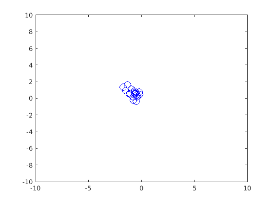
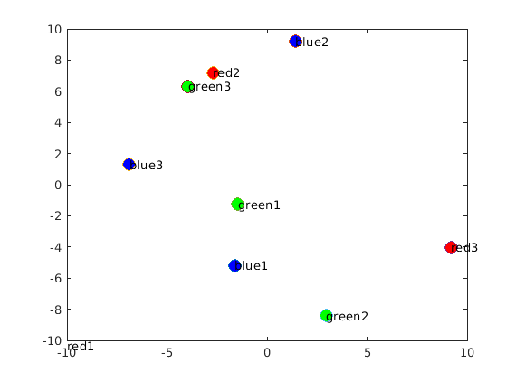
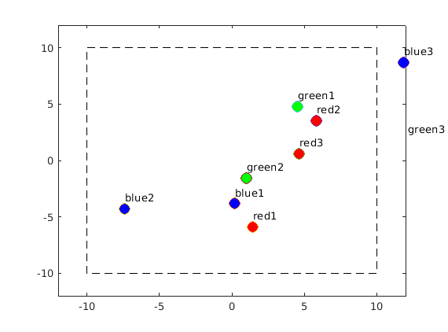

## Aula 2 - Visualização em Matlab

Tópicos a abordar:

Visualização em Matlab

- Desenho de pontos
- Cores e marcadores
- Animações com sobreposição do desenho
- Animações com alteração das propriedades do gráfico

### Exercício 2.1

Desenhe 100 pontos aleatoriamente gerados entre $x \in [-10,10], y \in [-5,5]$.

### Exercício 2.2

Aplique a um ponto $x,y$ uma translação em $t_x,t_y$ com valores aleatórios no intervalo $[-v, v]$, em que $v$ é a velocidade máxima.

Desenhe o ponto a mover-se pelo cenário aplicando sucessivos valores de $t_x$ e $t_y$

### Exercício 2.3

Altere o exercício anterior de modo a não desenhar sempre um novo ponto, mas sim para alterar o desenho do ponto anteriormente feito. NB. Ver a função _set_.

### Exercício 2.4

Prepare um programa que tenha 9 jogadores de três equipas, vermelha, verde e azul.

Sugere-se a criação de uma estrutura em matlab com os campos adequados.

### Exercício 2.5

Desenhe os jogadores na sua posição inicial.
Coloque em cima de cada jogador um texto com o seu nome.

### Exercício 2.6

Crie uma função _move_random_ para executar o movimento aleatório dos jogadores.

### Exercício 2.7

Crie um gráfico mais extenso, por exemplo de -12 a 12, e desenhe a caixa da arena.

### Exercício 2.8

Crie um mecanismo para detetar jogadores que saiam fora da arena e os coloque de volta no centro

### Exercício 2.9

Crie um mecanismo para detetar quando um jogador é caçado.

### Exercício 2.10

Crie um mecanismo para detetar quando um jogo deve ser terminado.

### Exercício 2.11

Implemente funções de movimento mais inteligentes. Cada elemento do grupo deve fazer uma função diferente para cada equipa, por forma a que os jogadores tenham comportamentos diferentes.
